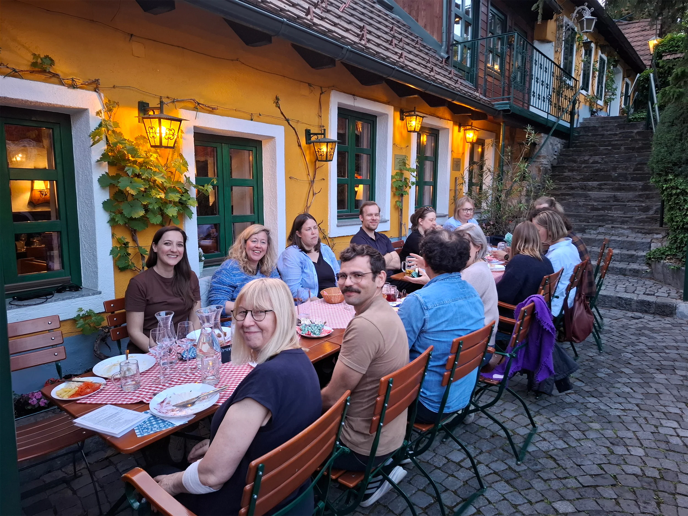

# BIOGAIN launches with kick-off meeting in Vienna

On 4 and 5 May 2026, the BIOGAIN consortium gathered in Vienna for the project's in-person kick-off, hosted by BOKU University. Researchers and practitioners from Austria, Germany, Denmark, Poland and the Netherlands came together to set the course for the first phase of work and to start translating the proposal into a concrete, shared research agenda.

## From mitigation to net-gain

BIOGAIN is built around a deliberate shift in vocabulary, and in ambition. Renewable energy planning has long been framed in terms of *mitigating* impacts on biodiversity. BIOGAIN asks a harder question: how can spatial planning for wind and solar infrastructure deliver a measurable *net-gain* for biodiversity, rather than simply treating nature impacts as a constraint to be minimised?

That shift demands robust, comparable data, new evaluation logics, and the willingness to make informed decisions based on these new data flows. It is also a precondition for _net-gain_ to become verifiable, rather than a promise.

## The role of AI-supported biodiversity data

Planners often lack recent, reliable and comparable data on ecosystems, species and multi-dimensional biodiversity. BIOGAIN investigates how digital and AI-supported monitoring &mdash; including passive acoustic monitoring, satellite and UAV imagery, environmental DNA, and deep learning models such as BirdNET, RNNs and transformer-based LLMs &mdash; can fill those gaps at the supra-local planning levels where decisions are actually made.

The project combines these data streams with a multi-method approach: spatial optimisation, serious games, discrete choice experiments and collaborative decision analyses. Together, these methods test how AI-supported biodiversity data can support societal change toward a net-gain in biodiversity, while making trade-offs between energy production, biodiversity and other land uses transparent.

## A European consortium

BIOGAIN brings together five universities:

- **[BOKU University](https://boku.ac.at/)** (Austria) &mdash; project coordination
- **[Technische Universität Berlin](https://www.tu.berlin/)** (Germany)
- **[Aalborg University](https://www.aau.dk/)** (Denmark)
- **[Wrocław University of Environmental and Life Sciences](https://upwr.edu.pl/)** (Poland)
- **[Utrecht University](https://www.uu.nl/)** (Netherlands)

In three case study regions, the consortium works with public authorities, politicians, SMEs in AI and biodiversity data, consultants and NGOs to co-develop decision support for "biodiversity net-gain solutions."

## Looking ahead

*Consortium members during the evening of the BIOGAIN kick-off in Vienna.*

The Vienna meeting set the tone for the years ahead: complex, multi-methodological research, close collaboration with practitioners across the five partner countries, and a shared ambition to make planning decisions that meet climate-neutrality targets *and* deliver more biodiverse landscapes.

A particular thanks goes to Alexandra Jiricka-Pürrer, Brady Mattsson, Eva Schöll and the BOKU team for hosting the kick-off and for leading the consortium.

More updates from the case study regions, methodological work packages and stakeholder events will follow in the coming months.
