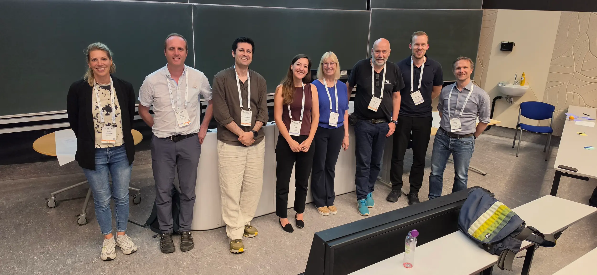

On 9 July 2026, members of the BIOGAIN team hosted the roundtable session “Enabling biodiversity-positive transformation of energy planning towards climate neutrality” ([link](https://cbd.eventsair.com/QuickEventWebsitePortal/eccb2026/programme/Agenda/AgendaItemDetail?id=18da6aec-60fa-4ea3-aac9-55cb9a794517)) at the [8th European Congress of Conservation Biology (ECCB)](http://eccb26leiden.eu/).

The session opened with an introductory presentation by Brady Mattsson, followed by Bart Hoekstra’s summary of a literature review on Essential Biodiversity Variables and a case study on Burgenland, Austria, presented by Raffael Koscher.

## Experiences from across Europe

Together with an international group of participants, the BIOGAIN team explored how biodiversity is accounted for in energy zoning and environmental impact assessments (EIAs), drawing on experiences from Austria, Finland and Portugal.

In Austria, EIAs for wind projects focus narrowly on the presence of birds and bats, often overlooking broader habitat impacts and citizen-science data. Austria’s federal structure also creates significant barriers to sharing data consistently across its nine federal states.

Finland is addressing similar issues by developing a centralised database intended to make data-sharing mandatory among EIA practitioners. Portugal, meanwhile, faces a shortage of biodiversity information during the early stages of energy zoning.

## Planning earlier for biodiversity

The panel concluded that achieving no net loss remains a major challenge. Biodiversity net-gain is even further from reach when interventions are limited to spatial energy planning alone.

To overcome these barriers, participants emphasised the urgent need to integrate robust biodiversity indicators and data-sharing much earlier in the strategic planning process, long before individual projects reach the approval stage.

*Group photo after the roundtable session at ECCB 2026.*

## Involved BIOGAIN team members

- **Anna Duden:** co-facilitator
- **Alexandra Jiricka-Pürrer:** project leader and co-organiser
- **Bart Hoekstra:** co-facilitator
- **Brady Mattsson:** project co-leader and co-organiser
- **Raffael Koscher:** co-organiser
- **Pita Verweij:** co-facilitator
- **Saeed Najd Ataei:** co-facilitator
