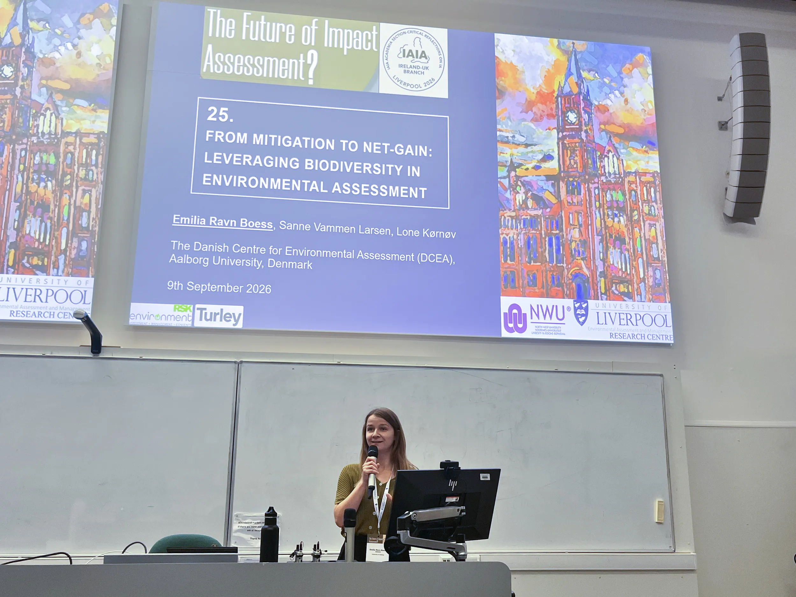
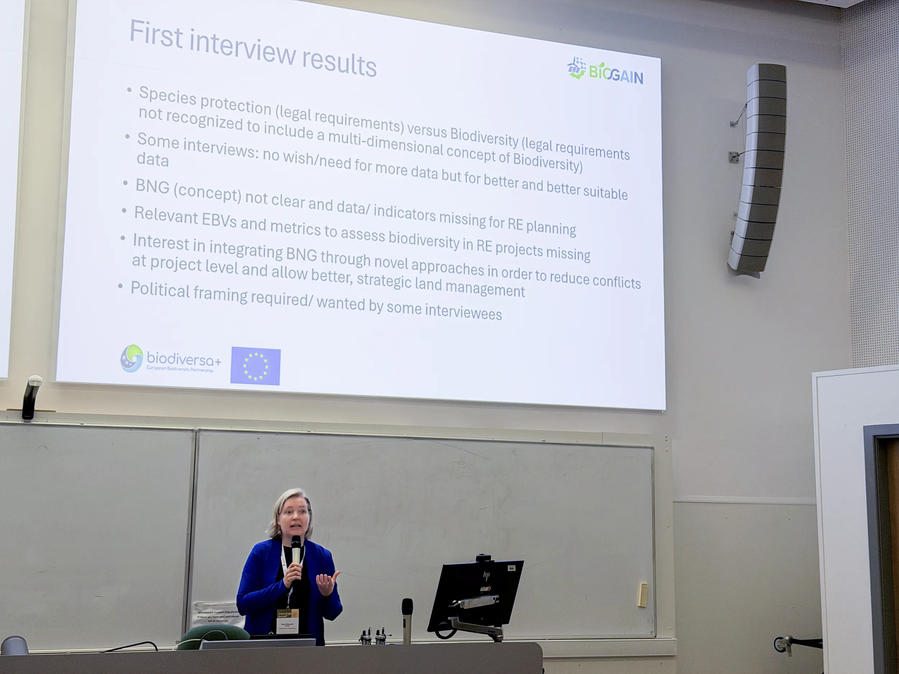

From September 8th to 10th, 2026, several BIOGAIN partners took part in the [Future of Impact Assessment International Conference](https://www.liverpool.ac.uk/environmental-sciences/future-of-impact-assessment/) in Liverpool, UK, to engage in sessions and discussions about the future of impact assessment (IA) practice.

At the conference, two BIOGAIN members, Gesa Geißler and Emilia Ravn Boess, presented preliminary findings from the project in a session alongside other IA experts, for an audience of practitioners and academics in the field. Framed around the need to rethink and strengthen current assessment practices, the BIOGAIN presentations highlighted how spatial energy planning can support more positive biodiversity outcomes and contribute to the delivery of biodiversity net gain.

## Transforming IA: Session findings

The session opened with a presentation by Emilia Ravn Boess, who shared findings from Work Package 1 (WP1) on identifying key levers for achieving biodiversity net gain. The work was based on a comprehensive review of the existing net-gain literature and explored opportunities for embedding more positive biodiversity outcomes within impact assessment and planning processes.

*Emilia Ravn Boess presents BIOGAIN's literature review findings.*

Building on these conceptual insights, Gesa Geißler presented preliminary findings from stakeholder interviews conducted in Germany and Austria. Drawing on perspectives from practitioners and policymakers, the presentation explored current experiences with biodiversity net gain, including opportunities, implementation challenges, data needs and potential AI applications for future impact assessment practice.

*Gesa Geißler presents preliminary findings from stakeholder interviews.*

Together, the presentations reflected on how IA can evolve from mitigating environmental harm towards actively supporting biodiversity net gain and more sustainable spatial planning approaches.
